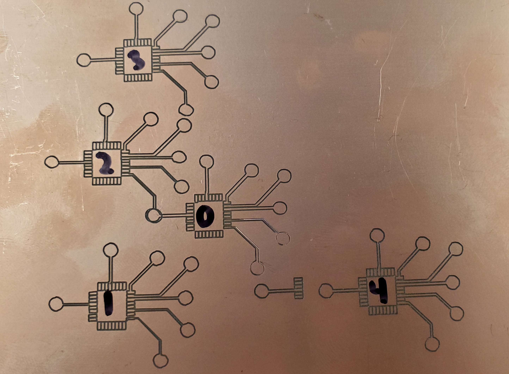

# Backlash  
Backlash  
MIT License - See LICENSE.md  
Copyright 2023 John Hamer  

This is a python script I wrote to generate a G-code file from an existing G-Code file with backlash compensation. I made this for my GRBL CNC router with belt drive. I could reduce backlash by tightening the belts, but I didn't like how tight they were. I use this for making PCBs with G-Code produced by flatcam.

I have only tested this with inch G-Code files. The code is in place for metric G-Code files, but is untested. This script only works with absolute positioning. When I use flatcam it output G-code files in inch with absolute positioning. I don't know it this is the case if flatcam is configured for metric units.

The backlash correction is a hard correction, so you can see the corrections in the work. I will change this to do a smooth correction over a configurable distance to minimize this. This script allowed me to make small surfacemount PCBs where the small traces/features were insonsistent or completely lost.

The script has an x, y, and z compensation distance. This is the ammount of backlash for each axis. I don't use z for PCBs. There is a threshold for how large of a change must occur after a direction change in the G-code for the script to apply the backlash. This is important because flatcam will put a small slant on straight lines.

The image above shows my development stages:  
0. no compensation, straight from flatcam  
1. first shot, no threshold. Note angled cuts where they should be straight  
2. threshold added  
3. tested some code that didn't work  
4. final result and current code.  

Future additions:  
1. Test and confirm metric G-code files work  
2. Add support for relative positioning  

Requirements:  
1. Python3.9 or later  
2. PySide2  
